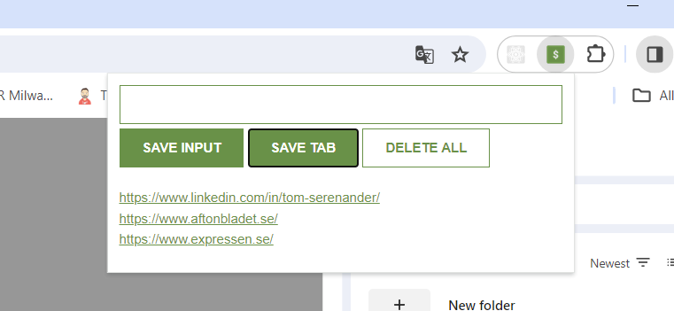

# Lead Saver

## Description
A small application in which you can save the current URL in the browser to a list. It can be added as a Chrome Extension to be used as shown below.

 

## Technologies
- HTML
- CSS
- JavaScript
- Chrome Extension

## Add as a Chrome Extension
1. Open Google Chrome and go to [chrome://extensions/](chrome://extensions/)
2. Turn on the Developer Mode switch
3. Click button "Load Unpacked" and select the main folder of this repo (05-lead-saver)
4. Open a new Google Chrome window and select extension "Lead Saver" - And use it!
